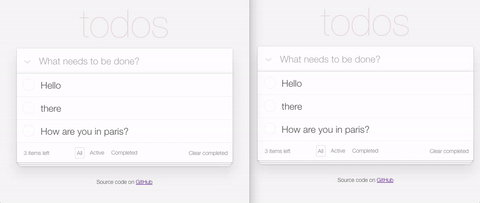

# next-todos
About 200 lines isomorphic todos app powered by next.js, redux and jet realtime.

The canonical TodoApp using [node-jet](https://github.com/lipp/node-jet) as realtime data backend mechanism. [Jet](https://jetbus.io) uses websockets for fetching/streaming the data and to make changes to the data.
[Redux](https://github.com/reactjs/redux) and (redux-jet)(https://github.com/lipp/redux-jet) are used for a clear and simple data flow.

It's note worthy, that the [redux store](https://github.com/lipp/next-todos/blob/master/store.js#L16) is identical for server and client js code! The only difference is that the store population on the server is triggered by the "finite" [redux-jet get](https://github.com/lipp/next-todos/blob/master/pages/index.js#L49) whereas the client issues an "infinite / streaming" [redux-jet fetch](https://github.com/lipp/next-todos/blob/master/pages/index.js#L56)

# Server

The server source can be found [here](https://github.com/lipp/node-jet/blob/master/examples/todo/todo-server.js) (90 Lines extra). 

# Inspect with Radar

[Radar](https://lipp.github.io/radar/#/) provides another view on the realtime data.

Enter this daemon url: `wss://todos-demo.now.sh`

# Not covered

- Authentication / session
- Scaling
